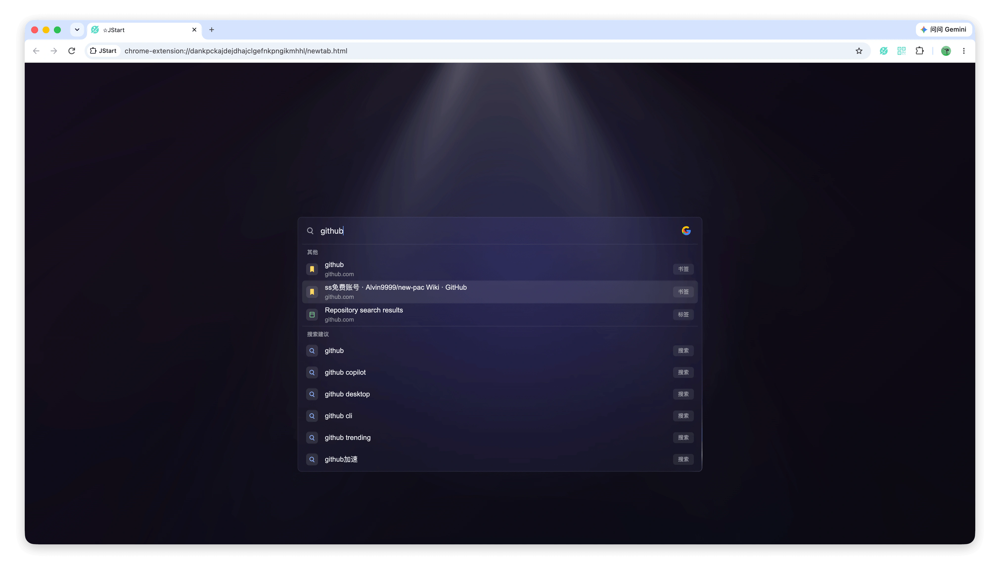

# JStart

JStart 是一个自用的 Chrome 插件。主要功能就是一个搜索框，任意页面都能唤起，搜索框支持快速到达想打开的页面和打开浏览器功能。仅在 Mac 上使用，Windows 上未测试。

搜索框已支持功能（Opinionated）：
* 搜索引擎：Google / Baidu / Bing
* AI 问答：豆包 / DeepSeek / Mimo
* 匹配书签页并打开
* 快速定位到已打开的 Tab
* 搜索历史记录并打开
* 自定义命令
* 识别网址并直接打开

## 界面截图



## 功能介绍

### 唤起方式
1. **新 Tab 起始页**

JStart 会替换 Chrome 的新 Tab 页面。新 Tab 后会展示搜索框；并自动激活。

2. **任意网页唤起搜索框**

在任意网页中都可以通过快捷键 `⌘ + J` 唤起 JStart 搜索框，搜索框会覆盖在当前页面上。

> 点击插件 icon 可以唤起或关闭 JStart 搜索框；
> 全局唤起需要到 `chrome://extensions/shortcuts` 为“全局唤起 JStart”手动设置 `⌃ + ⇧ + J`，并将作用范围设为“全局”；Chrome 运行时可在其他应用中唤起 Chrome 并打开 JStart。
> Chrome 只允许 `Ctrl + Shift + 0–9` 作为全局命令的默认快捷键，因此 `⌃ + ⇧ + J` 需要手动配置。
> 快捷键以 `chrome://extensions/shortcuts` 中的实际配置为准，可以自定义快捷键。

### 使用说明
* 未输入状态下，可以按 `Tab` 键切换搜索引擎
* 未输入状态下，回车直接打开搜索引擎首页
* `Esc` 按下，搜索消失，也可以点击背景空白处触发
* `Enter` 打开命中的第一个搜索结果，如果没有命中，就直接用搜索引擎搜索
* `⌘ + Enter` / `⌃ + Enter` 在新 Tab 打开当前结果
* 命中本地搜索结果，但想调用搜索引擎，可以加一个空格以后再回车
* `↑` / `↓` 可以调整命中结果
* 输入内容如果是网址，`Enter` 可直接打开，点击右边 `P` 切换到参数参看模式
* 斜杠命令，控制搜索某一个特定类型，如下

| 命令 | 功能 |
| --- | --- |
| `/b` | 搜索书签 |
| `/t` | 搜索已打开的 Tab |
| `/h` | 搜索历史记录 |
| `/ ` | 搜索所有本地结果，不包含历史记录 |

> 默认搜索范围里不包含历史记录；历史记录只能通过 `/h` 命令搜索；
> `/t` 会显示当前已打开的 Tab，排序会按照最近浏览顺序排列，方便切回刚刚离开的页面；


### 自定义快捷命令

可以在扩展设置页里配置自己的命令，比如：

```text
/jira 12345
/gh jstart
/doc keyword
```

自定义命令支持 URL 模板，可以使用：

- `{query}`：URL 编码后的搜索词
- `{raw}`：原始输入内容

也可以配置命令是否在新标签页打开。

### 其他功能说明

- 如果书签太多，可以在设置页设置要忽略的书签目录，被忽略的书签不会出现在搜索结果里
- 增加快捷键：`⌘ + ⌃ + ←` 在最近两个 Tab 之间切换，for 个人习惯
- 支持识别输入的搜索词是否适合走 AI 问答，设置页可以关闭


## 安装方式

1. 打开 Chrome 扩展管理页面：`chrome://extensions/`
2. 打开右上角「开发者模式」
3. 下载项目到本地，点击「加载已解压的扩展程序」加载本项目
4. 去插件设置页根据自己习惯设置
5. 到 `chrome://extensions/shortcuts` 检查或调整快捷键
